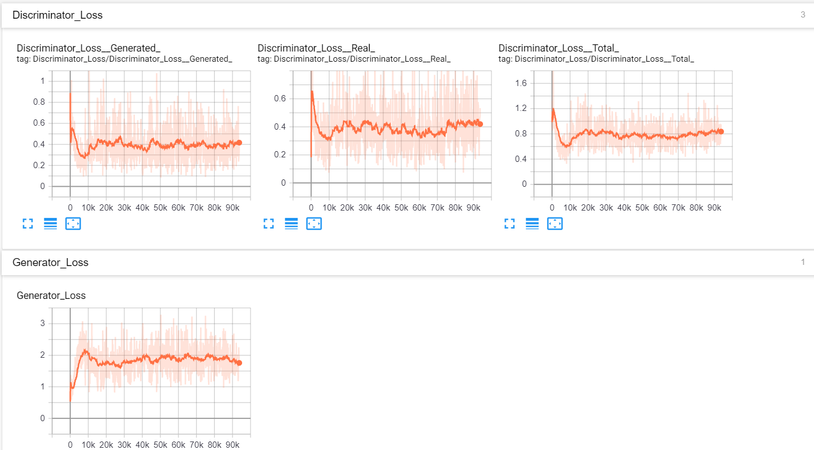
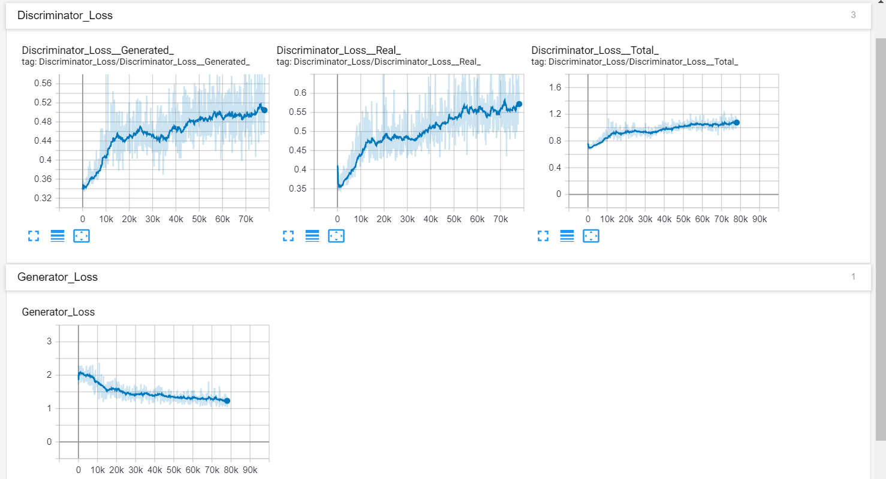
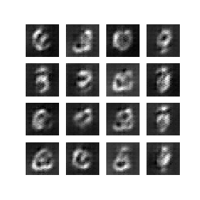
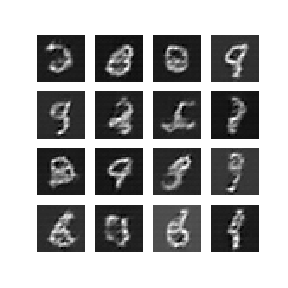
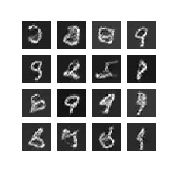
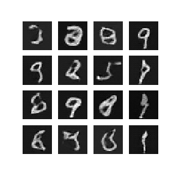
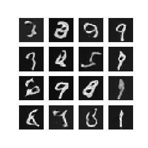

# Deep Convolutional GAN in TensorFlow
This repository contains code of DCGAN which is tested and trained on MNIST and CIFAR-10 datasets. It is based on TensorFlow 1.13 and uses Keras high level API for building layers.

## Generative Adversarial Networks
GANs are generally made up of two models: The Artist(Generator) and The Critic(Discriminator). The generator creates an image from random noise, and the discriminator evaluates the generated image from the images in the given dataset. We train the models by minmaxing the costs of the models. The generator tries to fool the discriminator by producing realistic looking images, and the discriminator becomes better in understanding the difference between real and fake images. This two player game improves the model until the generator produces images realistic images or the system reaches nash equilibrium.

## Model Architecture
This repo contains two different model architectures for MNIST and CIFAR-10 dataset.

### 1.) MNIST
#### Generator Model
Input(100)->Dense(7x7x256)->Reshape(7,7,256)->Conv2DTranspose(7,7,128)->Conv2DTranspose(14,14,64)->Conv2DTranspose(28,28,1)

Each Dense and Conv2DTranspose layer is accompanied by LeakyReLU and BatchNorm layer, except the last layer, which has TanH activation.

The first layer inputs 100-dimensional noise and outputs 7x7x256 = 12544 activations. This is reshaped to a (7,7,256) volume which is upsampled with the help of Conv2DTranspose layers. This continues until the final layer which gives the generated image (28,28,1).

#### Discriminator Model
Input(28,28,1)->Conv2D(14,14,64)->Conv2D(7,7,128)->Flatten(7x7x128)->Dense(1)

Both Conv2D layers are accompanied by LeakyReLU and Dropout layers.

The first layer inputs an (28,28,1) image and outputs a (14,14,64) volume. This is downsampled once again to get a (7,7,128) volume which is flattened and then the final dense layer outputs a single number (ideally 0 for fake/generated and 1 for real).

### 2.) CIFAR-10
The model architecture for CIFAR-10 dataset is similar to the above model except that the discriminator model is deeper(1 more downsampling layer)
#### Generator Model
Input(100)->Dense(4x4x512)->Reshape(4,4,512)->Conv2DTranspose(8,8,256)->Conv2DTranspose(16,16,128)->Conv2DTranspose(32,32,3)

#### Discriminator Model
Input(32,32,3)->Conv2D(16,16,128)->Conv2D(8,8,256)->Conv2D(4,4,512)->Flatten(4x4x512)->Dense(1)

## Model Hyperparameters
### Layer Properties
1.) Convolutional and Deconvolutional layers in the model use 5x5 filters and strides of 2 (except the first deconv layer in MNIST generator)

2.) The LeakyReLU layers have weight 0.3

3.) The Dropout layers have frequency of 0.5

4.) MNIST model has Keras default weight initializer

5.) CIFAR-10 model has Xavier Uniform weight initializer

6.) None of the layers use any bias

### Optimizers
Both models use Adam optimizers with learning rate of 0.0001 and default values for beta1 and beta2

### Training Parameters
#### MNIST
Batch size of 32 is used and the model is trained for 50 epochs

#### CIFAR-10
Batch size of 128 is used and the model is trained for 200 epochs

## Repository Overview
The repository contains the following files and folders:-
### data_loader.py
Contains helper functions to that import datasets from the web and preprocess them.
### main.py
Contains reference code to start training models from scratch or to generate images from saved models.
### model.py
Contains helper functions to create Generator and Discriminator models for MNIST and CIFAR-10 datasets.
### model.txt
Contains Google Drive links to trained Generator models
### train.py
Contains helper functions to train models and to generate images.
### generated_images
Folder containing images generated by the model. Has images built during training for MNIST and some sample images from trained model for CIFAR-10.
### loss_graph_logs
Folder containing loss graph logs made during training.

## Setup Instructions and Dependencies
You may setup the repository on your local machine by either downloading it or running the following line on `cmd prompt`.

``` Batchfile
git clone https://github.com/Atharv24/GenZoo.git
```

The trained models are large in size and hence their Google Drive links are provided in the `model.txt` file.

### Packages required
+ TensorFlow 1.13
+ Matplotlib 3.1.0

### Training models from scratch
The `main.py` file contains 2 helper functions `train_mnist_model_from_scratch()` and `train_cifar_model_from_scratch()`

These functions do the following:-
+ Load the required dataset and preprocess it
+ Make the discriminator and generator models
+ Train those models using the batch size and epochs provided as the arguments to the function
+ Return the trained generator and discriminator model

### Loading trained models and generating images
To load trained models:-
+ Download the trained generator models from the Google Drive link provided in the `model.txt` file
+ Copy the `gen_model.h5` file to root of **DCGAN** folder (preferably)
+ Load the generator model by using `gen_model = tf.keras.models.load_model('gen_model.h5')`
+ Generate images by using `generate_and_save_images(gen_model)`
+ The image will be saved as `sample_image_from_epoch_0000.png` in the folder **generated_images**

### Viewing Loss Graphs
To view the loss graphs for the models run the following command at the root of **DCGAN** folder:-

```Batchfile
tensorboard --logdir=loss_graph_logs
```
Then goto `localhost:6006` on your browser to view the logs

#### Loss graph for MNIST


#### Loss graph for CIFAR-10


## Sample images from the model
### MNIST
Images showing the process of training of the model







### CIFAR-10
Some sample images from the trained model

.png)
.png)
.png)
.png)
.png)

## Observations
### MNIST
The model takes only 50 epochs to train which happens in under 20 mins in Google Colab. The generated images are quite sharp and are usually indistinguisable from the real data. The model captures the subtlety of the data and is able to create images which look handwritten.

Training for long duration (100+ epochs) does not seem to improve the model's performance and sometimes even deteriorates the quality of the images produced.

### CIFAR-10
Training on the CIFAR-10 dataset was challenging. The dataset was varied and the network has higher number of parameters to train. This resulted in training times of upto 2 min/epoch on Google Colab. The model was trained for 200 epochs and produced images which were similar to the dataset.

However the main problem faced by me was observing 32x32 images and evaluating if they were 'good enough'. The images are too low-resolution to properly understand the subject but they are easily passable since they look quite similar to the real data.

Some images have noise but most images dont have much artifacts in them. This is party due to the network training on whole 10 labels of the CIFAR-10 dataset. Better results could be obtained by only training the network on one particular label at a time but this takes away the robustness of the model.

## Credits
To make this repository I referenced multiple sources:
+ Generative Adversarial Networks — Goodfellow et al. (2014)
+ DCGANs — Radford et al. (2015)
+ MIT intro to deep learning (2019) - Lecture 4
+ TensorFlow DCGAN tutorial
