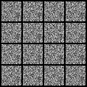
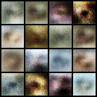
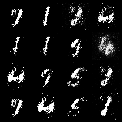
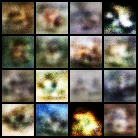
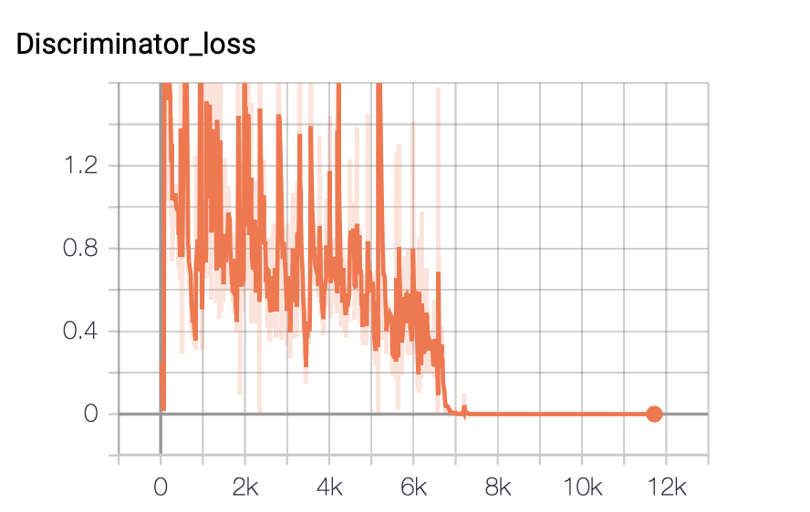
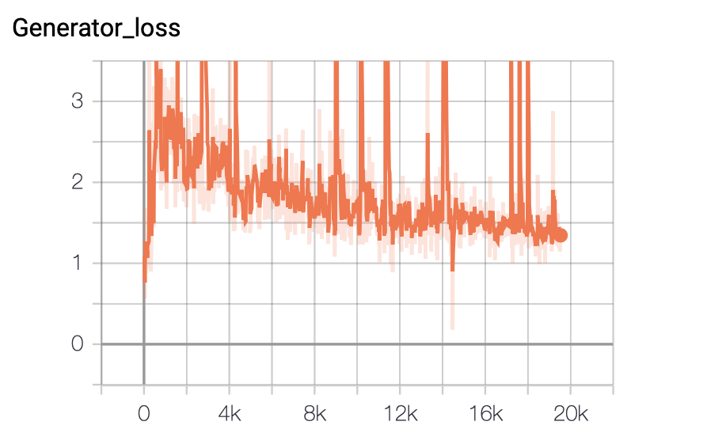
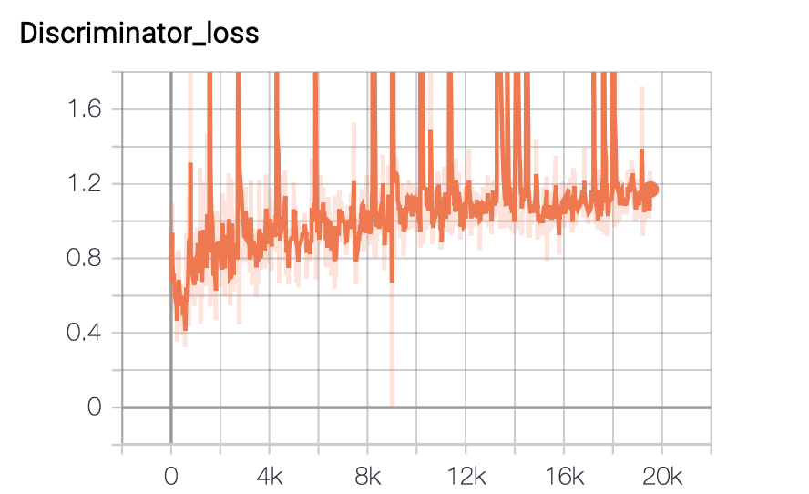

# Fully Connected GAN(also known as Vanilla GAN) in Pytorch
This repository contains code of FCGAN which is tested and trained on MNIST and CIFAR-10 datasets. It is based on Pytorch framework.



## Generative Adversarial Networks
GANs are generally made up of two models: The Artist (Generator) and The Critic (Discriminator). The generator creates an image from random noise, and the discriminator evaluates the generated image with the images in the given dataset. We train the models by minimaxing the costs of the models. The generator tries to fool the discriminator by producing realistic looking images, and the discriminator becomes better in understanding the difference between real and fake images. This two player game improves the model until the generator produces realistic images or the system reaches nash equilibrium.

## Contents
1. [Setup Instructions and Dependencies](#1-setup-instructions-and-dependencies)
2. [Training Model from Scratch](#2-training-model-from-scratch)
3. [Generating Images from Trained Models](#3-generating-images-from-trained-models)
4. [Model Architecture](#4-model-architecture)
5. [Repository Overview](#5-repository-overview)
6. [Results Obtained](#6-results-obtained)
    1. [Generated Images](#i-generated-images)
    2. [Parameters Used](#ii-parameters-used)
    3. [Loss Curves](#iii-loss-curves)
7. [Observations](#7-observations)
8. [Credits](#8-credits)

## 1. Setup Instructions and Dependencies
You may setup the repository on your local machine by either downloading it or running the following line on `terminal`.

``` Batchfile
git clone https://github.com/vlgiitr/GenZoo.git
```

The trained models are large in size and hence their Google Drive links are provided in the `model.txt` file.

The data required for training is automatically downloaded when running `train.py`.

All dependencies required by this repo can be downloaded by creating a virtual environment with Python 3.7 and running

``` Batchfile
pip install -r requirements.txt
```

Make sure to have CUDA 10.0.130 and cuDNN 7.6.0 installed in the virtual environment.  For a conda environment, this can be done by using the following commands:

```Batchfile
conda install cudatoolkit=10.0
conda install cudnn=7.6.0
```

## 2. Training Model from Scratch
To train your own model from scratch, run

```Batchfile
python train.py -config path/to/config.ini
```

+ The parameters for your experiment are all set by defualt. But you are free to set them on your own.
+ The training script will create a folder **exp_name** as specified in your `config.ini` file.
+ This folder will contain all data related to your experiment such as tensorboard logs, images generated during training and training checkpoints.

## 3. Generating Images from Trained Models
To generate images from trained models, run

```Batchfile
python generate.py --dataset mnist/cifar-10 --load_path path/to/checkpoint --grid_size n --save_path directory/where/images/are/saved
```

The arguments used are explained as follows

+ `--dataset` requires either `mnist` or `cifar10` according to what dataset the model was trained on.
+ `--load_path` requires the path to the training checkpoint to load. Point this towards the *.index file without the extension. For example `-load_path training_checkpoints/ckpt-1`.
+ `--grid_size` requires integer `n` and will generate n*n images in a grid.
+ `--save_path` requires the path to the directory where the generated images will be saved. If the directory doesn't exist, the script will create it.

To generate images from pre-trained models, download checkpoint files from the Google Drive link given in the `model.txt` file.

## 4. Model Architecture
### Generator Model
+ `MNIST`: The generator model is a 5-layer MLP with LeakyReLU activation function followed by a Tahn non-linearity in the final layer.
+ `CIFAR10`: The generator model is a 6-layer MLP with LeakyReLU activation function followed by a Tahn non-linearity in the final layer.
+ Input is a 100-dimensional noise. It is passed through the network to produce either a 28x28x1 (MNIST) or 32x32x3 (CIFAR-10) image.

### Discriminator Model
+ `MNIST`: The discriminator model is a 3-layer MLP with LeakyReLU activation function followed by a Sigmoid non-linearity in the final layer.
+ `CIFAR10`: The discriminator model is a 4-layer MLP with LeakyReLU activation function followed by a Sigmoid non-linearity in the final layer.
+ Output is a single number which tells if the image is real or fake/generated.

## 5. Repository Overview
This repository contains the following files and folders

1. **experiments**: This folder contains data for different runs.

2. **resources**: Contains media for `readme.md`.

3. `data_loader.py`: Contains helper functions that load and preprocess data.

4. `generate.py`: Used to generate and save images from trained models.

5. `model.py`: Contains helper functions that create generator and discriminator models.

6. `model.txt`: Contains google drive links to trained models.

7. `requirements.txt`: Lists dependencies for easy setup in virtual environments.

8. `train.py`: Contains code to train models from scratch.

## 6. Results Obtained
### i. Generated Images
Samples generated after training model for 100 epochs on MNIST.


Samples generated after training model for 200 epochs on CIFAR-10.


### ii. Parameters Used
+ Optimizer used is Adam
+ Learning rate 0.0002, beta-1 0.5
+ Trained for 100 epochs (MNIST) and 100 epochs (CIFAR10)
+ Batch size is 128 for both  (MNIST) and (CIFAR10)
+ The model uses label flipping (i.e. real images are assigned 0 and fake images are assigned 1)

### iii. Loss Curves
#### MNIST


#### CIFAR-10


## 7. Observations
### MNIST
The model took around 12 minutes to train for 100 epochs on the gpu. The generated images are not that sharp but somewhat resemble the real data. The model is also prone to mode collapse.

Training for long duration (150+ epochs) does not seem to improve the model's performance and sometimes even deteriorates the quality of the images produced.

### CIFAR-10
Training on the CIFAR10 dataset was challenging. The dataset was varied and the network has a higher number of parameters to train. The model was trained for 200 epochs and took about 30 minutes to train.

However the main problem faced by me was observing 32x32 images and evaluating if they were 'good enough'. The images are too low-resolution to properly understand the subject but they are easily passable since they look quite similar to the real data.

Some images have noise but most images don't have much artifacts in them. This is partly due to the network training on all of the 10 labels of the CIFAR-10 dataset. Better results could be obtained by only training the network on one particular label at a time but this takes away the robustness of the model.

## 8. Credits
To make this repository I referenced multiple sources:
+ [Generative Adversarial Networks — Goodfellow et al. (2014)](https://arxiv.org/abs/1406.2661)
+ [MIT intro to deep learning (2019) - Lecture 4](https://www.youtube.com/watch?v=yFBFl1cLYx8)
+ [Ian Goodfellow: Generative Adversarial Networks (NIPS 2016 tutorial)](https://www.youtube.com/watch?v=HGYYEUSm-0Q)
