# Variational Auto Encoder (VAE) in Pytorch
The repository consists of a variational autoencoder implemented in pytorch and trained on MNIST dataset . It can be used to generate images and also for generating cool T-SNE visulaisations of the latent space .

## VAE : Overview

Variational autoencoders at first glance seems like another autoencoder . An autoencoder basically consists of an encoder and a decoder . **The encoder converts the input into another dimension space , generally of a smaller size**  and then tries to reconstruct the input from this representation . This kind of forces the network to filter out the not so useful features and only stores useful features .  So this is sometimes used to get a lower dimension representation of our data .

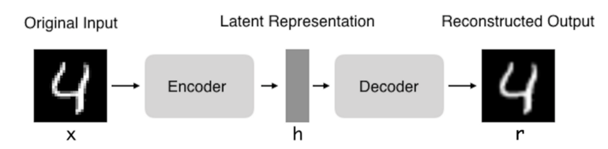


Now whats so special about Variational autoencoders .

Well this is not a tutorial for VAE so let's just get an overview .

Now VAE is a generative model ..meaning it can be used to generate new data . Now why can't we use a standard autoencoder to do this . The problem **with the standard auto-encoder is that the latent space repesentation of the data follows some very complex distribution which is not known to us** . So we can't sample new latent variables from that distribution and decode them into something that looks like an image .

So that's were **VAE are different ..they constraint the latent space representation to be of that of a unit gaussian** which we can easily sample from and use to create new samples . 

Now this is done using ..well a lot of complicated maths ..something called variational inference . I guess its easier to explain it using the loss function . 


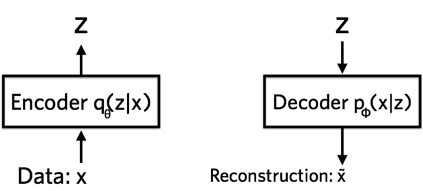     

 `Loss = Ez∼Q(z|x)[logP(x|z)]−KL[Q(z|x)||P(z)]`
  
  
The first term is basically maximising the likelihood of the input data and is simply said the reconstruction loss . The second term is a KL divergence loss and it measures the similarity of `Q(z|x)` and `P(z)` . `P(z)` is what the distribution of the latent variables should be (ie . unit gaussian) and `Q(z|x)` is our approximator of `P(z)` using the encoder neural network ( Its also a gaussian but with mean and variance output by the encoder)

## Contents
1. [Setup Instructions and Dependencies](#1-setup-instructions-and-dependencies)
2. [Training your model from scratch](#2-training-your-model-from-scratch)
3. [Generating images from model](#3-generating-images-from-model)
4. [Repository Overview](#4-repository-overview)
5. [Architecture](#5-architecture)
6. [Results](#6-results)
    1. [Training images](#1-training-images)
    2. [T-sne Visualization](#2-t-sne-visualization)
    3. [Image generated from random gaussian input ](#3-image-generated-from-random-gaussian-input)
    4. [Smooth transition between two digits](#4-smooth-transition-between-two-digits)
    5. [Training Graphs](#5-training-graphs)
    6. [Single digit generated samples](#6-single-digit-generated-samples)
7. [Observations](#7observations)
8. [Credits](#8-credits)

So basically the loss has two opposing functions ..the reconstruction loss which tries to recreate the input as such not caring about the latent variable distribution and the KL divergence term which forces the distribution to be gaussian .

## 1. Setup Instructions and Dependencies
You can either download the repo or clone it by running the following in cmd prompt
```
https://github.com/ayushtues/GenZoo.git
```
You can create a virtual environment and run the below command to install all required dependecies

```
pip3 install -r requirements.txt
```

## 2. Training your model from scratch

You can train the model from scratch by the following command 
```
python main.py --config /path/to/config.ini

```
The `config.ini` file should specify all the required parameters of the model.  
**To train on gpu set gpu = 1 else gpu = 0 in config.ini**

The program automatically downloads the MNIST dataset and saves it in `MNIST_dataset` (creating the folder itself) . This only happens once

It also creates a `experiments` folder and inside it creates a `exp_name` folder as specified in your config.ini file .

The `exp_name` file has 3 folders
- `training_checkpoints` - Contains  the  models saved with frequency as specified in `model_save_frequency` in  `config.ini`
- `training_images` -  Contains the reconstructed training images saved with frequency as  specified in `image_print_frequency` in `config.ini`
- `t_sne` - Contains the T-SNE visualization of the latent space with number of points as specified by `t_sne_points` in `config.ini`

## 3. Generating images from model

To generate new images from z sampled randomly from uniform gaussian and to make a nice digit transit grid run the following command.  
 
It can also generate a single digit , for which it basically takes the mean of the means and variance produced for all samples in the test dataset for that digit and uses this averaged mean and variance to sample some latent variables and pass it in the decoder .
```
python generate.py  --dataset [DATASET] --model_path [PATH_TO_MODEL] --grid_size [GRID_SIZE] --save_path [SAVE_DIRECTORY]  --z_dims [Z_DIMENSIONS] --grid_size2 [GRID_SIZE2] --no_datapoints [NO_DATAPOINTS] --digit [DIGIT]
```

- `dataset`      - the dataset to generate new images from (Currently only MNIST(case sensitive) allowed)
- `model_path`   - the path to the pre-trained model
- `grid_size`    - the size of the grid of the images generated (grid_size X grid_size matrix created) (default 8)
- `save_path`    - the directory where to save the images
- `z_dims`       - the size of the latent space (Useful if training models with different z_dims otherwise) (default 20 )
- `grid_size2`   - the size of the grid of the generated images of a single number sampled randomly
- `no_datapoints`- the number of test datapoints used for approximating mean and var of the single digit
- `digit`        - the digit to generate   

You can use a pre-trained model (with z_dims = 20) by downloading it from the link in `model.txt`

## 4. Repository Overview

The repository contains of the following files

- `main.py` - Does the major work , Calls functions from various other files to nake , train , save the model and also do the t-sne visualisation .
- `train.py`-  Has the loss function , also the function to display images in a grid , save the reconstructed training images and also the model. Basically handles the training.
- `model.py` - Contains the VAE model , the encoder , decoder , forward functions.
- `dataloader.py` - Returns a dataloader from the MNIST dataset with given batch size .
- `generate-py` - Generates new images and also the transition between two digits grid from a pretrained model.
- `model.txt` - Contains link to a pretrained model (with z_dims =20)
- `readme.md` - Readme giving overview of the repo
- `requirements.txt` - Has all the required dependencies to be installed  for the repo
- `readme_images` - Has various images for the readme
- `configs` - Has the config.ini file 
- `MNIST_dataset` - Contains the downloaded MNIST Dataset(though `main.py` will download it if needed automatically)
- `experiments` - Has various results of the training of the model
    - `generated_images` - Contains the digit_transit images and also new generated images
    - `mnist` - Contains the saved models , training images , and t-sne visualisation
- `runs` Contains the tensorboard logs (automatically created by program)

Do the following to run tensorboard

```
tensordboard --logdir path/to/directory/runs
```
## 5. Architecture

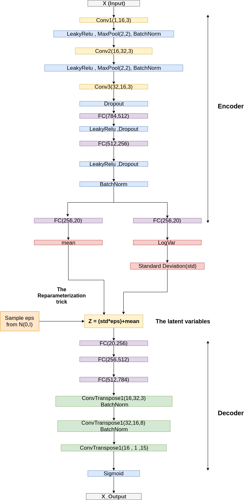

The architecture is basically divided into two parts  an encoder and a decoder .
The encoder first has a bunch of convultional layers with LeakyRelu activation function and max pooling and batchnorm . The last conv layer also has dropout. Then there are a bunch of Fully connected layers with leakyRelu activation and dropout . Finally a fully connected layer gives us the mean and logvar respectively.

Then we sample from the distribution using the reparameterisation trick . With z = (std*eps)+mean , where eps = N (0,I) .

The decoder consists of a bunch of fully conncected layers followed by Transpose Convolutional layers and finally a sigmoid function which gives the output images .
## 6. Results
### 1. Training images
Image from 0th epoch  

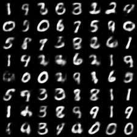

Image from 20th epoch  

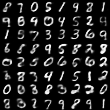

Image from 40th epoch  

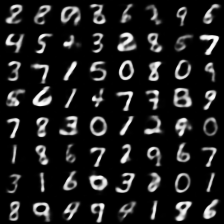

Image from 60th epoch  

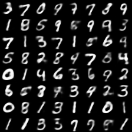

Image from 80th epoch  

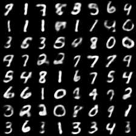

Image from 95th epoch  
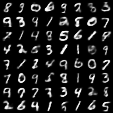  
  
    
 As we can see the reconstruction is a bit blurred and has scope for improvement.

### 2. T-sne Visualization

After 100 epochs the t-sne visualisation is     

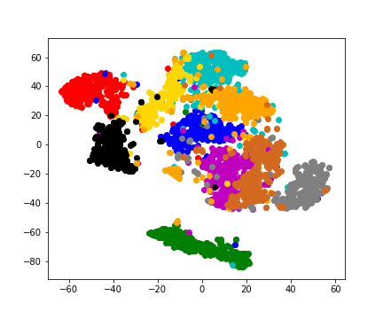  
  
 As we can see there are clearly 10 clusters formed and also there is a smooth transition between them , which means the model is working fine ( although there is 1 seperate cluster )

### 3. Image generated from random gaussian input 

The following image was generated after passing a randomly sampled z from the unit gaussian and then passed through the decoder       

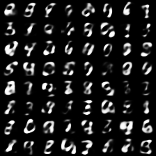

  
 Although its clear that the images could be better but still they resemble digits well enough for a randomly sampled gaussian input .

### 4. Smooth transition between two digits

The following shows images formed when the latent variable z of one image was uniformly changed into that of another image and was passed through the decoder 

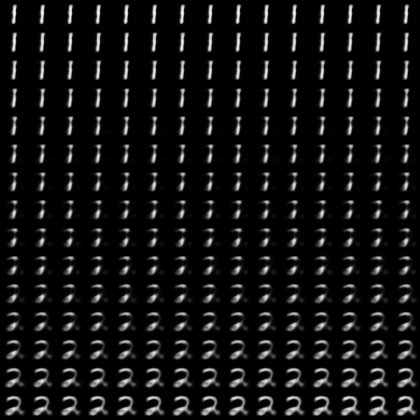    
 As we can see there is a smooth transition between  1 and 2
  
### 5. Training Graphs
  **KLD LOSS**
  
   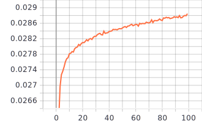      
    
   **As we can see the KLD loss actually increased**
     
   **Reconstruction Loss**  
      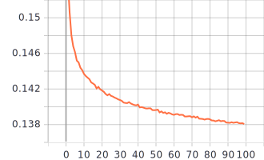  
        
   **Total_Loss**
         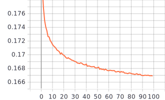  


   **As we can see the total loss and reconstruction loss decrease uniformly as expected**
   
### 6 . Single digit generated samples
The following images are genrated by randomly sampling latent variables from a gaussian with mean and var given by the average of all the means and var output by all the test examples of the images belonging to that class  
  
Generated images of digit 1
 
 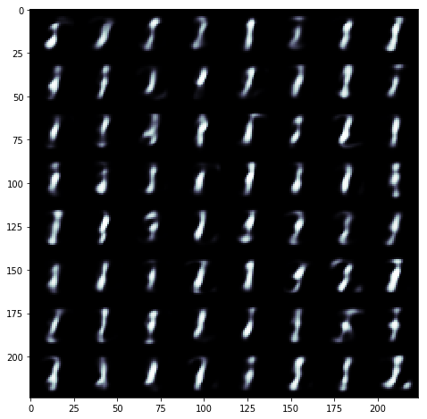    

Generated images of digit 9  

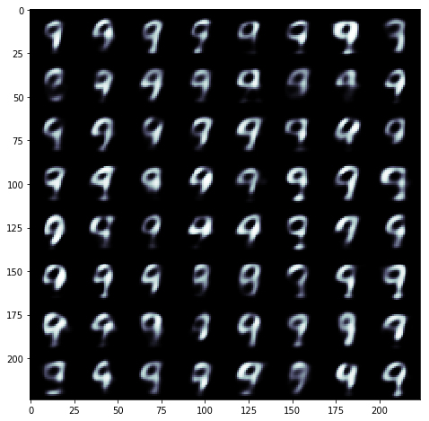 
  
 As we can the see the images resemble the corresponding digits . 

 ## 7.Observations
 The model was trained on google colab for 100 epoch , with batch size 50 . It took approx 10-15 mins to train .  
 
 After training the model was able to reconstruct the input images quite well , and was also able to generate new images although the generated images are not so clear .  
 The T-sne visualisation of the latent space shows that the latent space has been divided into 10 clusters , but also has smooth transitions between these spaces , indicating that the model forced the latent space to be a bit similar with the normal distribution .   
 The digit-transit images show that **latent space has a linear nature** and linearly changing the latent variables from one digit to another leads to a smooth transition .    
   
  **Also using the estimate of mean and var for a single class , and generating samples from it gave pretty good images , so this might mean that the marginal distribution of a particular class is can be approximated by a gaussian with the mean and var as given by the method and the dataset can be viewed as a sum of 10 different gaussians**
 
 One peculiar thing to notice was that the **KL-Divergence loss actually increased as the model trained** .  
 I found a  possible explanation at  [this reddit post](https://www.reddit.com/r/MachineLearning/comments/6m2tje/d_kl_divergence_decreases_to_a_point_and_then/)  
   
 TLDR : Guess its easier for the model to make the distribution gaussian so it first does that , but a perfect gaussian means that there is no uniqueness introduced by the training images , so after a while the distribution shifts from a perfect gaussian to incorporate the subtle patterns in the data and thus increasing the KLD loss .
 
 ## 8. Credits
 The following sources helped a lot to make this repository
 
 - [Auto-Encoding Variational Bayes - 
Diederik P Kingma, Max Welling](https://arxiv.org/abs/1312.6114)
 - [VAE Tutorial by Carl Doersch](https://arxiv.org/abs/1606.05908)
 - [Tutorial - What is a variational autoencoder? – Jaan Altosaar
](https://jaan.io/what-is-variational-autoencoder-vae-tutorial/)
 - [Variational Autoencoder: Intuition and Implementation](https://wiseodd.github.io/techblog/2016/12/10/variational-autoencoder/)
 - https://github.com/Atharv24/GenZoo/tree/master/DCGAN
 - https://github.com/aniket-agarwal1999/VAE-Pytorch
 
 
 
